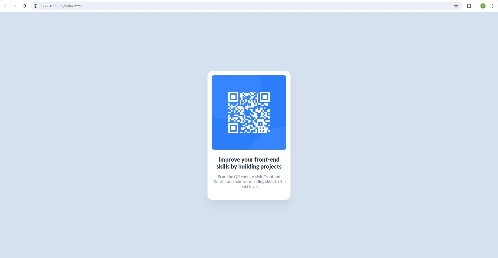

# Frontend Mentor - QR code component

[ Front-End Mentor Challenge ] A simple static card that would allow users to scan a QR code.

## Table of contents

- [Overview](#overview)
  - [Screenshot](#screenshot)
  - [Links](#links)
- [My process](#my-process)
  - [Built with](#built-with)
  - [What I learned](#what-i-learned)
  - [Useful resources](#useful-resources)
- [Author](#author)

**Note: Delete this note and update the table of contents based on what sections you keep.**

## Overview

### Screenshot



### Links

- Solution URL: (https://github.com/wpena/fem-qr-code-component/blob/main/index.html)
- Live Site URL: (https://wpena.github.io/fem-qr-code-component/)

## My process

### Built with

- Semantic HTML5 markup
- CSS
- Flexbox
- Mobile-respinsive

### What I learned

I learnt that when creating a box-shadow in CSS, the first value is for offset-x (Left (Negative value to offset left) or Right (Positive value to offset right)) and the second value is for offest-y (Up (Negative value to offset up and) or Down (Positive value to offset down)). The third value is to add a blur and fourth value is for spread (How big you want the shadow to be), and finally followed by a color. I used rgba to give it a color and opacity. The 'a' is for alpha which controls the opacity.

Example: 
```css
.card-body {
  box-shadow: 0 25px 25px rgba(0, 0, 0, 0.05);
}
```

### Useful resources

- [FreeCodeCamp Resource](https://www.freecodecamp.org/news/css-box-shadow-property-with-examples/) - This helped me understand how box-shadows work and how to use them.

## Author

- LinkedIn - [Pena W](https://www.linkedin.com/in/penaw)
- Frontend Mentor - [@wpena](https://www.frontendmentor.io/profile/wpena)
